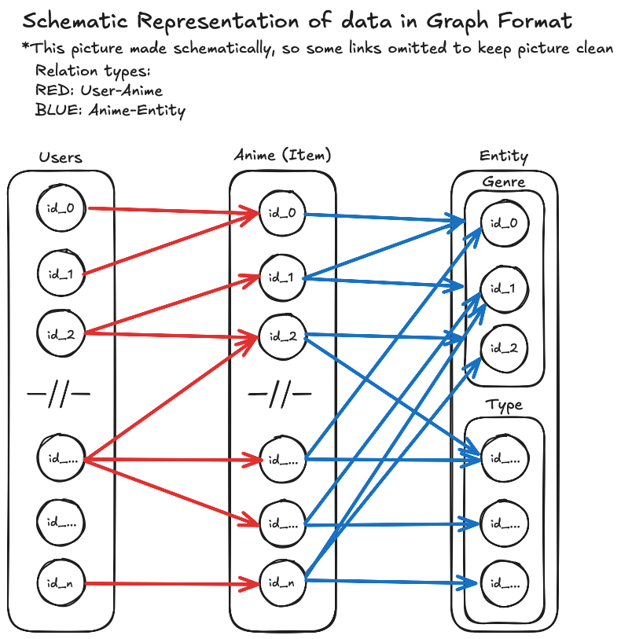
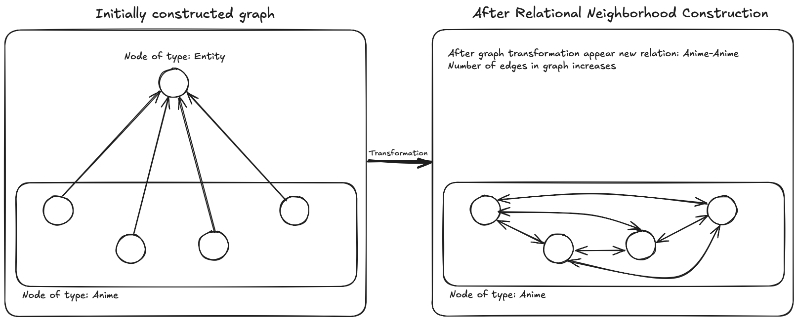

# Recomendational System using Graph Neural Networks with Pytorch Geometric for DSKReG implementation

## Table of Contents

- [Introduction](#introduction)
- [What is DSKReG](#what-is-dskreg)
- [Dataset Exploration](#dataset-exploration)
- [Dataset Preparation](#dataset-preparation)
  - [Initial Graph and Feature Preprocessing](#initial-graph-and-feature-preprocessing)
  - [PyG Dataset Construction](#pyg-dataset-construction)
- [DSKReG Model](#dskreg-model)
  - [Differentiable Sampling](#differentiable-sampling)
  - [Preference Aware Aggregation](#preference-aware-aggregation)
  - [Creating Loss](#creating-loss)
  - [Model Training](#model-training)

## Introduction

Recomendation Systems or RecSys play a crucial role in our world - mostly each digital product uses it in some way. You defenetly had experiance of interacting with RecSys: your moives and snacks recomendation generated by RecSys. chances are you’ve experienced both its successes and failures. For example, a recommendation engine might suggest a genre of movies you dislike (e.g., horror films, when you only watch sci-fi). Therefore, creation of great RecSys become an essential step for businesses in today’s digital world.

RecSys algorithms (or models) have both: advanteges and disadvantages. With _Graph Neural Networks (GNNs)_ emerged a powerful approach to recommendation systems, with capability of modeling complex relationships and dependencies between users, items, and their attributes. DSKReG (Differentiable Sampling on Knowledge Graph for Recommendation with Relational GNN) is one such advanced method that uses Graph Neural Networks to improve recommendations, and we’ll see how we can implement it using [PyTorch Geometric](https://pytorch-geometric.readthedocs.io/en/latest/).

You can see our code in [this jupyter notebook](link)
For a more detailed explanation, you can check out the paper [Differentiable Sampling on Knowledge Graph for Recommendation with Relational GNN](https://arxiv.org/pdf/2108.11883v1).

## What is DSKReG

DSKReG is an approach to recommendation systems that integrates graph-based models with relational data. It specifically focuses on knowledge graphs (KG), which represent relationships between different entities (such as users, items, and their interactions). The model utilizes Graph Neural Networks (GNNs), which are designed to learn representations of graph-structured data, to process the relationships between entities and generate recommendations.

The main advantage of DSKReG lies in its ability to differentiate sampling within knowledge graphs. By doing so, it can handle complex relationships between users and items, thereby improving the quality of the recommendations.

The authors of the paper highlight two key features of DSKReG:

1. Differentiable Sampling: This means the model can be trained end-to-end, which is not possible with traditional graph-based models that require non-differentiable components.
2. Relational GNN: The model uses a relational version of GNNs, meaning it can take into account various types of relations in the graph, which is crucial for recommendation tasks that involve multiple different types of interactions.

## Dataset Exploration

For our demonstration, we’ve chosen the [anime dataset](https://www.kaggle.com/datasets/CooperUnion/anime-recommendations-database), a popular dataset in recommendation system research. This dataset contains information about various anime titles, users who rated them, and their corresponding ratings.

Dataset has following usefull information:

- User-Anime Interaction information: table of user_id, anime_id and rating from 0 to 10 if user rated the anime title or -1 otherwise
- Anime Information: genres and type (Movie, TV)

## Dataset Preparation

Import all needed packages and read the dataset:

```python
import torch_geometric
from torch_geometric.data import Data
from torch_geometric.loader import DataLoader, LinkNeighborLoader
import torch_geometric.transforms as T
import torch

import networkx as nx

import numpy as np
import pandas as pd
import matplotlib.pyplot as plt
import pickle

# Load dataset
anime = pd.read_csv("../data/anime.csv")
rating = pd.read_csv("../data/rating.csv")
```

### Initial Graph and Feature Preprocessing

We will convert the graph to [NetworkX](https://networkx.org) graph initially, after this step we will transform graph using "Relational Neighborhood Construction" approach, then to the Pytorch Geometric dataframe.

The NetworkX has quite understandable function naming, therefore we won't explain basic actions with it.

As we discussed earlier, our graph has connections, such as "User-Anime", "Anime-Entity". Let's create this graph:

```python
def get_graph(anime: pd.DataFrame, rating: pd.DataFrame) -> nx.Graph:
    # Get copies of dataframes, so we won't corrupt original ones, clean NaNs
    anime = anime.copy()
    rating = rating.copy()
    anime['genre'] = anime['genre'].str.split(', ')
    anime = anime.drop(columns=['name', 'members'])
    anime = anime.dropna()
    rating = rating.dropna()

    # Data extaction for graph creation
    anime_id = set(anime['anime_id'])
    genre = anime.explode('genre')

    rating = [(f'user_{i}', f'anime_{j}', r) for i, j, r in zip(rating['user_id'], rating['anime_id'], rating['rating']) if j in anime_id]
    genre = [(f'anime_{i}', f'genre_{j}') for i, j in zip(genre['anime_id'], genre['genre'])]
    tp = [(f'anime_{i}', f'type_{j}') for i, j in zip(anime['anime_id'], anime['type'])]

    user_id = list(set(i for i, j, r in rating))
    anime_id = list(set(j for i, j, r in rating))
    genres = list(set(j for i, j in genre))
    types = list(set(j for i, j in tp))

    # Adding data to graph
    G = nx.Graph()

    G.add_nodes_from(user_id, node_type="user")
    G.add_nodes_from(anime_id, node_type="anime")
    G.add_nodes_from(genres, node_type="entity")
    G.add_nodes_from(types, node_type="entity")

    G.add_weighted_edges_from(rating)
    G.add_edges_from(genre)
    G.add_edges_from(tp)

    return G
```

Now our graph is in following format:



## Relational Neighborhood Construction

### Graph Convolutions

...

### Idea behind Relational Neighborhood Construction

For exploration and data aggregation on our graph, we need to make at least 3 convolutions:

1. User-Anime
2. Anime-Entity
3. Entity-Anime

(Optionally) It could be assumed to find anime suggestion based on interaction of user with similar 'behavior', but for this we need to make two mode convolutions:

4. Anime-User
5. User-Anime

Let's break these cases. Firstly, _Entity_ nodes store some information and help to connect _Anime_ nodes for prediction of new Anime titles for user. Secondly, we have huge number of connections between User-Anime node categories, so following the 'optional' approach could lead to exploring all nodes in the graph, which is not optimal.

How we could overcome these limitation?

1. Eliminate _Entity_ node type with no information loss
2. Using limited number of neighbours to choose from during convolutions

DSKReG has a way to close the first issue, by interconnecting Anime/Item nodes that share same Entity neighbors. You can see below has this is done:



With one problem solved, we gain new issue: the number of edges increased (for our case it's approximatly in quadratic way), therefore it become harder to process graph. The increase in edges highly depend on the Item-Entity initial relation of second-order neighbors for one entity: we have about 11k Anime nodes with only ~50 Entity nodes, so for our case increase is significant: we got about 40 million edges.

- For simplicity we will cut anime-titles with member's number less than $100$.
- We use straightforward preprocessing (it could be optimised with saving some data on local drive during computations, and possibly some increase comes from NetworkX's gigantic graph)

### Implementation

Here is our straightforward implementation of Relational Neighborhood Construction

### PyG Dataset Construction

Now we finished with intial dataset preparation, so we can preprocess all the features into edge indexes for our PyG Dataset.

## DSKReG Model

DSKReG model consist of two main parts: Differentiable Sampling and Preference Aware Aggregation.
PyG greatly help us. Let's declare our model:

```python
from torch_geometric.nn.conv import MessagePassing
from torch_geometric.utils import softmax
import torch.nn as nn
import torch_scatter


class DSKReG(MessagePassing):
    def __init__(
        self,
        input_dim: int,
        hidden_dim: int,
        num_relations: int,
        num_classes: int,
        top_k: int = 5,
    ) -> None:
        super(DSKReG, self).__init__()

        self.input_dim = input_dim
        self.hidden_dim = hidden_dim

        self.num_relations = num_relations
        self.num_classes = num_classes

        self.top_k = top_k

        self.linear_rel = nn.Linear(hidden_dim * 2, 1, bias=True)
        self.linear_agg = nn.Linear(hidden_dim, hidden_dim, bias=True)

        self.relation_weight = nn.Parameter(torch.randn(hidden_dim))

```

MessagePassing is ...
torch_scatter ...

### Differentiable Sampling

```python
class DSKReG(MessagePassing):
    ...

    def gumbel_softmax_sampling(self, relevance_score, index):
        grouped_scores = softmax(relevance_score, index=index)

        # Gumbel noise creation
        gumbel_noise = (
            torch.rand_like(grouped_scores).log() - torch.rand_like(grouped_scores).log()
        )

        softmax_logits = torch.softmax(
            (torch.log(grouped_scores) + gumbel_noise) / self.tau,
            dim=0
        )

        _, top_k_indices = torch.topk(
            softmax_logits,
            self.top_k,
            dim=0,
            largest=True,
            sorted=False,
            out=None
        )

        mask = torch.zeros_like(softmax_logits)
        mask[top_k_indices] = 1.0

        return mask * softmax_logits
```

### Preference Aware Aggregation

The model will look at User-Anime interactions. It will learn how users interact with anime titles by aggregating information from the items they have interacted with. For example, it a user has watched several anime titles, the model will combine the features of those titles to create a representation of the user in "item-space”

```python
class DSKReG(MessagePassing):
    ...

    def rel_scores(self, relation_emb, neighbor_emb):
        concat_emb = torch.cat([relation_emb, neighbor_emb], dim=-1)
        return torch.softmax(self.linear_rel(concat_emb).squeeze(-1), dim=0)

    def gumbel_softmax_sampling(self, relevance_score, index):
        grouped_scores = softmax(relevance_score, index=index)

        # Gumbel noise creation
        gumbel_noise = (
            torch.rand_like(grouped_scores).log() - torch.rand_like(grouped_scores).log()
        )

        softmax_logits = torch.softmax(
            (torch.log(grouped_scores) + gumbel_noise) / self.tau,
            dim=0
        )

        _, top_k_indices = torch.topk(
            softmax_logits,
            self.top_k,
            dim=0,
            largest=True,
            sorted=False,
            out=None
        )

        mask = torch.zeros_like(softmax_logits)
        mask[top_k_indices] = 1.0

        return mask * softmax_logits
```

### Creating Loss

We use the dot-product to generate the preference score of user $u$ to item $i$ with the inferred user/item embeddings $\hat{\mathbf{e}}_{u}$ and $\hat{\mathbf{e}}_{i}$, respectively.

The prediction is calculated as follows: $\hat{y}_{ui} = \sigma(\hat{\mathbf{e}}_{u}^{\intercal} \hat{\mathbf{e}}\_{i}) $

DSKReG uses BPR loss to optimize top-N recommendation, which is defined as follows:

$ \mathcal{L}_{bpr} = \sum_{(u,l,j) \in \mathcal{D}} -\text{log} \sigma \left( \hat{y}(u,l) - \hat{y}(u,j) \right) + \lambda ||\Theta||^{2}\_{2} $

```python
class DSKReG(MessagePassing):
    ...
    def loss(self, user_emb, pos_item_emb, neg_item_emb, reg_lambda=0.001):
        pos_scores = (user_emb * pos_item_emb).sum(dim=-1)
        neg_scores = (user_emb * neg_item_emb).sum(dim=-1)

        bpr_loss = -torch.log(torch.sigmoid(pos_scores - neg_scores)).mean()
        l2_norm = (
            user_emb.norm(2).pow(2)
            + pos_item_emb.norm(2).pow(2)
            + neg_item_emb.norm(2).pow(2)
        )

        return bpr_loss + reg_lambda * l2_norm
```

For loss calculation during training model gets negative examples, witch are items user $u$ has never interacted with.

### Model Training
